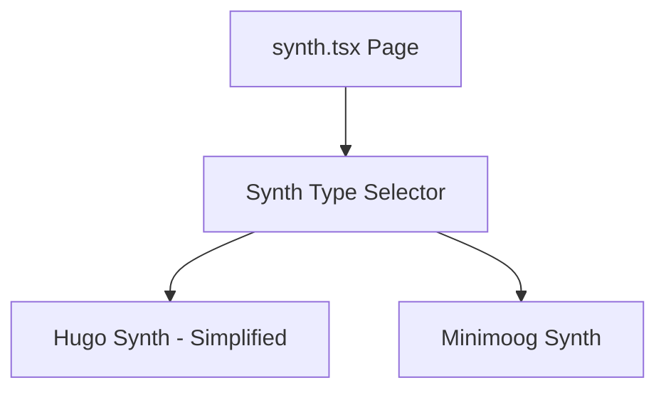

# Multi-Synth Feature Implementation

## Architecture

Create a synth selector at the page level that switches between different synth components:

## Changes Overview

### 1. Simplify PianoKeyboard Component

Modify [`src/components/PianoKeyboard.tsx`](src/components/PianoKeyboard.tsx) to accept an optional prop for number of octaves:

- Add `octaves?: 1 | 2` prop (default: 2 for backward compatibility)
- When `octaves=1`, show only C4-C5 (13 keys: 8 white, 5 black)
- Update keyboard mappings to use a simpler single-row layout: `A S D F G H J K` for white keys, `W E T Y U` for black keys

### 2. Simplify Existing Synth Component

Modify [`src/components/Synth.tsx`](src/components/Synth.tsx):

- Remove Drone mode state and related logic (lines 35, 59-62, 206-209, 222-224, 288-329, 544-564)
- Remove Mic mode state and related logic (lines 38-39, 66-69, 227-286, 566-595)
- Pass `octaves={1}` to PianoKeyboard

### 3. Create Minimoog Synth Component

Create new [`src/components/MinimoogSynth.tsx`](src/components/MinimoogSynth.tsx) with Minimoog-inspired characteristics:

- Distinct visual style: wood grain panel sides, cream/off-white face, red accents
- 3 oscillators (typical of Minimoog) with individual waveform/octave controls
- 24dB/octave ladder filter (sharper than the standard 12dB)
- Simplified control set focused on classic Minimoog parameters
- Oscilloscope and 1-octave keyboard (reusing existing components)

### 4. Update Synth Page with Selector

Modify [`src/routes/synth.tsx`](src/routes/synth.tsx):

- Add synth type state: `"hugo" | "minimoog"`
- Create styled tab/selector buttons at the top
- Conditionally render the appropriate synth component
- Update instructions section based on selected synth
- Remove drone-related instruction text

## File Changes Summary

| File | Action ||------|--------|| `src/components/PianoKeyboard.tsx` | Modify - add octaves prop || `src/components/Synth.tsx` | Modify - remove Drone/Mic, use 1-octave keyboard |
